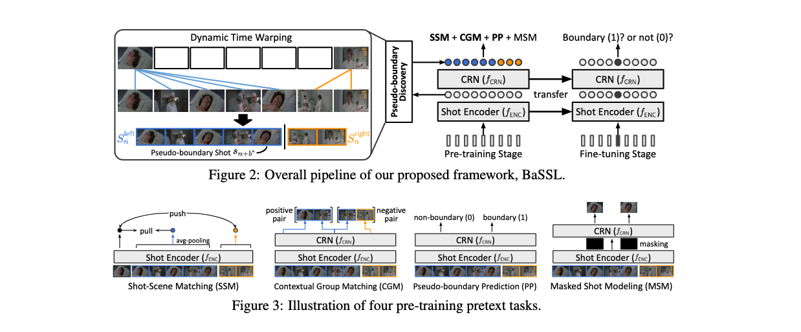

[](http://kakaobrain.com/)
[](https://pytorch.org/)
[](https://www.pytorchlightning.ai/)


# BaSSL
This is an official PyTorch Implementation of **Boundary-aware Self-supervised Learning for Video Scene Segmentation (BaSSL)** [[arxiv]](https://arxiv.org/abs/2201.05277) [[demo in modelscope]](https://modelscope.cn/models/damo/cv_resnet50-bert_video-scene-segmentation_movienet/summary)
  - The method is a self-supervised learning algorithm that learns a model to capture contextual transition across boundaries during the pre-training stage. To be specific, the method leverages pseudo-boundaries and proposes three novel boundary-aware pretext tasks effective in maximizing intra-scene similarity and minimizing inter-scene similarity, thus leading to higher performance in video scene segmentation task.

<p align="center"></p>


## 1. Environmental Setup
We have tested the implementation on the following environment:
  * Python 3.7.7 / PyTorch 1.7.1 / torchvision 0.8.2 / CUDA 11.0 / Ubuntu 18.04   

Also, the code is based on [pytorch-lightning](https://www.pytorchlightning.ai/) (==1.3.8) and all necessary dependencies can be installed by running following command. 
```bash
$ pip install torch==1.7.1+cu110 torchvision==0.8.2+cu110 torchaudio==0.7.2 -f https://download.pytorch.org/whl/torch_stable.html
$ pip install -r requirements.txt

# (optional) following installation of pillow-simd sometimes brings faster data loading.
$ pip uninstall pillow && CC="cc -mavx2" pip install -U --force-reinstall pillow-simd
```

## 2. Prepare Data
We provide data download script for raw key-frames of MovieNet-SSeg dataset, and our re-formatted annotation files applicable for BaSSL.
FYI, our script will automatically download and decompress data---1) key-frames (160G), 2) annotations (200M)---into `<path-to-root>/bassl/data/movienet`.
```bash
# download movienet data
$ cd <path-to-root>
$ bash script/download_movienet_data.sh
```
In addition, download annotation files from [MovieNet-SSeg google drive](https://drive.google.com/drive/folders/1F-uqCKnhtSdQKcDUiL3dRcLOrAxHargz) and put the folder `scene318` into `<path-to-root>/bassl/data/movienet`. Then, the data folder structure will be as follows:

```bash
# <path-to-root>/bassl/data
movienet
│─ 240P_frames
│    │─ tt0120885                 # movie id (or video id)
│    │    │─ shot_0000_img_0.jpg
│    │    │─ shot_0000_img_1.jpg
│    │    │─ shot_0000_img_2.jpg  # for each shot, three key-frames are given.
|    |    :
│    :    │─ shot_1256_img_2.jpg
│    |    
│    │─ tt1093906
│         │─ shot_0000_img_0.jpg
│         │─ shot_0000_img_1.jpg
│         │─ shot_0000_img_2.jpg
|         :
│         │─ shot_1270_img_2.jpg
│
│─anno
     │─ anno.pretrain.ndjson
     │─ anno.trainvaltest.ndjson
     │─ anno.train.ndjson
     │─ anno.val.ndjson
     │─ anno.test.ndjson
     │─ vid2idx.json
│─scene318
     │─ label318
     │─ meta
     │─ shot_movie318
```

## 3. Train (Pre-training and Fine-tuning)
We use [Hydra](https://github.com/facebookresearch/hydra) to provide flexible training configurations.
Below examples explain how to modify each training parameter for your use cases.  
We assume that you are in `<path-to-root>` (i.e., root of this repository).  


### 3.1. Pre-training

**(1) Pre-training BaSSL**  
Our pre-training is based on distributed environment (multi-GPUs training) using [ddp environment supported by pytorch-lightning](https://pytorch-lightning.readthedocs.io/en/latest/advanced/multi_gpu.html).  
The default setting requires 8-GPUs (of V100) with a batch of 256. However, you can set the parameter `config.DISTRIBUTED.NUM_PROC_PER_NODE` to the number of gpus you can use or change `config.TRAIN.BATCH_SIZE.effective_batch_size`.
You can run a single command `cd bassl; bash ../scripts/run_pretrain_bassl.sh` or following full command:  
```bash
cd <path-to-root>/bassl
EXPR_NAME=bassl
WORK_DIR=$(pwd)
PYTHONPATH=${WORK_DIR} python3 ${WORK_DIR}/pretrain/main.py \
    config.EXPR_NAME=${EXPR_NAME} \
    config.DISTRIBUTED.NUM_NODES=1 \
    config.DISTRIBUTED.NUM_PROC_PER_NODE=8 \
    config.TRAIN.BATCH_SIZE.effective_batch_size=256
```
Note that the checkpoints are automatically saved in `bassl/pretrain/ckpt/<EXPR_NAME>` and log files (e.g., tensorboard) are saved in `bassl/pretrain/logs/<EXPR_NAME>.

**(2) Running with various loss combinations**  
Each objective can be turned on and off independently.  
```bash
cd <path-to-root>/bassl
EXPR_NAME=bassl_all_pretext_tasks
WORK_DIR=$(pwd)
PYTHONPATH=${WORK_DIR} python3 ${WORK_DIR}/pretrain/main.py \
    config.EXPR_NAME=${EXPR_NAME} \
    config.LOSS.shot_scene_matching.enabled=true \
    config.LOSS.contextual_group_matching.enabled=true \
    config.LOSS.pseudo_boundary_prediction.enabled=true \
    config.LOSS.masked_shot_modeling.enabled=true
```

**(3) Pre-training shot-level pre-training baselines**  
Shot-level pre-training methods can be trained by setting `config.LOSS.sampling_method.name` as one of followings:
  - `instance` (Simclr_instance), `temporal` (Simclr_temporal), `shotcol` (Simclr_NN).  
And, you can choose two more options: `bassl` (BaSSL), and `bassl+shotcol` (BaSSL+ShotCoL).  
Below example is for `Simclr_NN`, i.e., ShotCoL. Choose your favorite option ;)  
```bash
cd <path-to-root>/bassl
EXPR_NAME=Simclr_NN
WORK_DIR=$(pwd)
PYTHONPATH=${WORK_DIR} python3 ${WORK_DIR}/pretrain/main.py \
    config.EXPR_NAME=${EXPR_NAME} \
    config.LOSS.sampleing_method.name=shotcol \
```


### 3.2. Fine-tuning  

**(1) Simple running a single command to fine-tune pre-trained models**  
Firstly, download the checkpoints provided in Model Zoo section and move them into `bassl/pretrain/ckpt`.
```bash
cd <path-to-root>/bassl

# for fine-tuning BaSSL (10 epoch)
bash ../scripts/finetune_bassl.sh

# for fine-tuning Simclr_NN (i.e., ShotCoL)
bash ../scripts/finetune_shot-level_baseline.sh
```
The full process (i.e., extraction of shot-level representation followed by fine-tuning) is described in below.


**(2) Extracting shot-level features from shot key-frames**    
For computational efficiency, we pre-extract shot-level representation and then fine-tune pre-trained models.  
Set `LOAD_FROM` to `EXPR_NAME` used in the pre-training stage and change `config.DISTRIBUTED.NUM_PROC_PER_NODE` as the number of GPUs you can use.
Then, the extracted shot-level features are saved in `<path-to-root>/bassl/data/movienet/features/<LOAD_FROM>`.
```bash
cd <path-to-root>/bassl
LOAD_FROM=bassl
WORK_DIR=$(pwd)
PYTHONPATH=${WORK_DIR} python3 ${WORK_DIR}/pretrain/extract_shot_repr.py \
	config.DISTRIBUTED.NUM_NODES=1 \
	config.DISTRIBUTED.NUM_PROC_PER_NODE=1 \
	+config.LOAD_FROM=${LOAD_FROM}
```

**(3) Fine-tuning and evaluation**
```bash
cd <path-to-root>/bassl
WORK_DIR=$(pwd)

# Pre-training methods: bassl and bassl+shotcol
# which learn CRN network during the pre-training stage
LOAD_FROM=bassl
EXPR_NAME=transfer_finetune_${LOAD_FROM}
PYTHONPATH=${WORK_DIR} python3 ${WORK_DIR}/finetune/main.py \
	config.TRAIN.BATCH_SIZE.effective_batch_size=1024 \
	config.EXPR_NAME=${EXPR_NAME} \
	config.DISTRIBUTED.NUM_NODES=1 \
	config.DISTRIBUTED.NUM_PROC_PER_NODE=1 \
	config.TRAIN.OPTIMIZER.lr.base_lr=0.0000025 \
	+config.PRETRAINED_LOAD_FROM=${LOAD_FROM}

# Pre-training methods: instance, temporal, shotcol
# which DO NOT learn CRN network during the pre-training stage
# thus, we use different base learning rate (determined after hyperparameter search)
LOAD_FROM=shotcol_pretrain
EXPR_NAME=finetune_scratch_${LOAD_FROM}
PYTHONPATH=${WORK_DIR} python3 ${WORK_DIR}/finetune/main.py \
	config.TRAIN.BATCH_SIZE.effective_batch_size=1024 \
	config.EXPR_NAME=${EXPR_NAME} \
	config.DISTRIBUTED.NUM_NODES=1 \
	config.DISTRIBUTED.NUM_PROC_PER_NODE=1 \
	config.TRAIN.OPTIMIZER.lr.base_lr=0.000025 \
	+config.PRETRAINED_LOAD_FROM=${LOAD_FROM}
```


## 4. Model Zoo
We provide pre-trained checkpoints trained in a self-supervised manner.  
After fine-tuning with the checkpoints, the models will give scroes that are almost similar to ones shown below.   

| Method             |   AP   | Checkpoint (pre-trained) |
|:-------------------|:------:|:------------------------:|
| SimCLR (instance)  | 51.51  | [download](https://arena.kakaocdn.net/brainrepo/bassl/checkpoints/Simclr_instance.tar.gz)   |
| SimCLR (temporal)  | 50.05  | [download](https://arena.kakaocdn.net/brainrepo/bassl/checkpoints/Simclr_temporal.tar.gz)   |
| SimCLR (NN)        | 51.17  | [download](https://arena.kakaocdn.net/brainrepo/bassl/checkpoints/Simclr_NN.tar.gz)         |
| BaSSL (10 epoch)   | 56.26  | [download](https://arena.kakaocdn.net/brainrepo/bassl/checkpoints/bassl.tar.gz)             |
| BaSSL (40 epoch)   | 57.40  | [download](https://arena.kakaocdn.net/brainrepo/bassl/checkpoints/bassl_40epoch.tar.gz)     |


## 5. Citation
If you find this code helpful for your research, please cite our paper.
```
@article{mun2022boundary,
  title={Boundary-aware Self-supervised Learning for Video Scene Segmentation},
  author={Mun, Jonghwan and Shin, Minchul and Han, Gunsu and
          Lee, Sangho and Ha, Sungsu and Lee, Joonseok and Kim, Eun-sol},
  journal={arXiv preprint arXiv:2201.05277},
  year={2022}
}
```


## 6. Contact for Issues
Jonghwan Mun, [jason.mun@kakaobrain.com](jason.mun@kakaobrain.com)  
Minchul Shin, [craig.starr@kakaobrain.com](craig.starr@kakaobrain.com)  


## 7. License
This project is licensed under the terms of the [Apache License 2.0](./LICENSE).
Copyright 2021 [Kakao Brain Corp](https://www.kakaobrain.com). All Rights Reserved.
